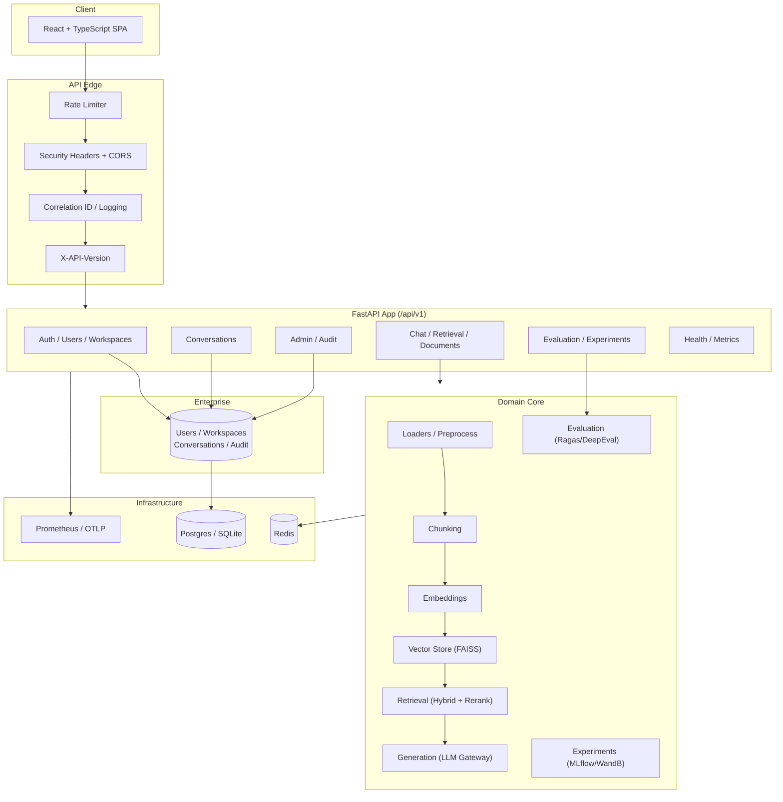
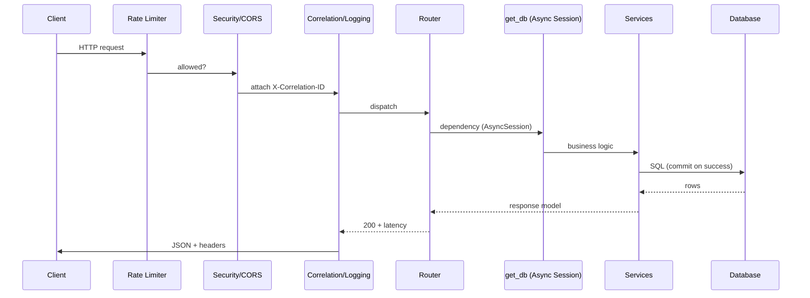
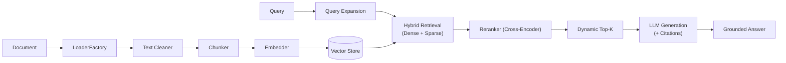
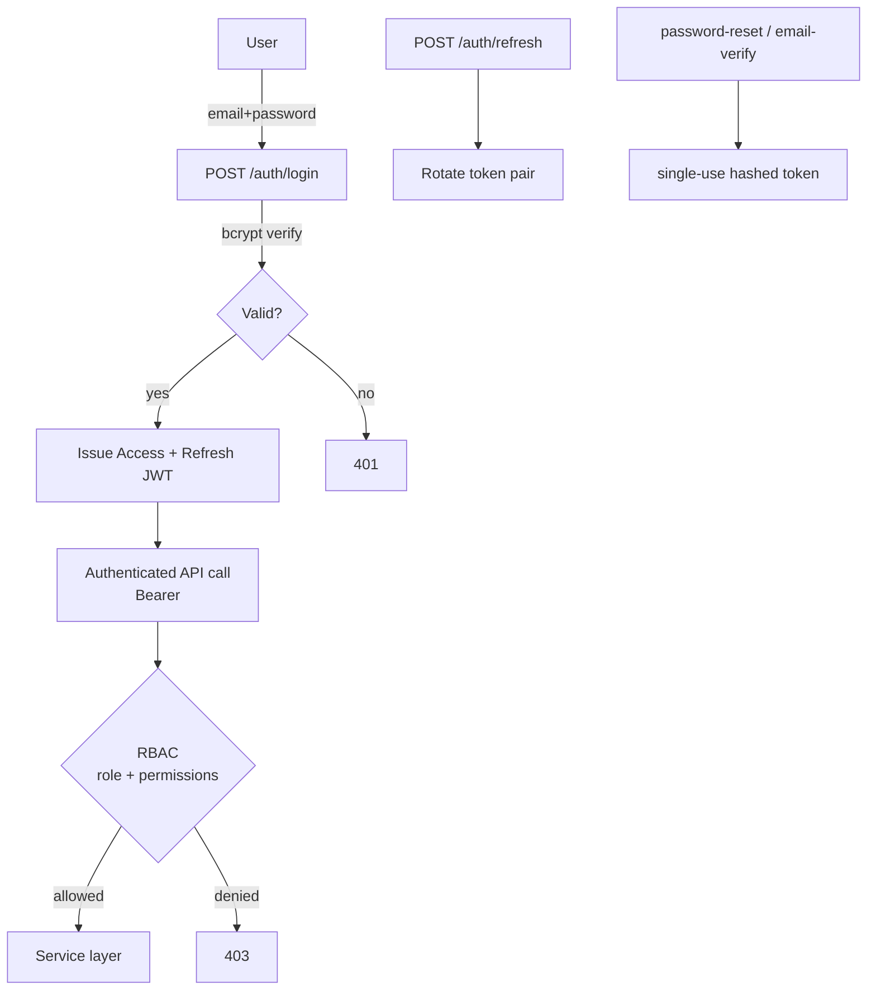

# Architecture Guide — Retrieval Intelligence Platform (RIP)

This guide is the single entry point to RIP's architecture. Detailed,
per-component write-ups live in [`docs/architecture/`](./architecture/); this
document provides the maps and the mental model. All diagrams are
[Mermaid](https://mermaid.js.org/) and render natively on GitHub.

---

## 1. System Overview

RIP is a modular Retrieval-Augmented Generation (RAG) platform. A FastAPI
backend exposes versioned REST APIs (RAG + enterprise) and an async SQLAlchemy
data layer; a React/TypeScript frontend consumes them. Configuration is
environment-driven and validated on startup.

---

## 2. Request Lifecycle

Every request flows through the middleware stack (outer → inner) before
reaching a router, and back out through logging/headers.

---

## 3. RAG Data Flow

---

## 4. Enterprise Authentication Flow

Roles: `admin` (all perms), `member` (create/export/delete own), `viewer`
(shared-KB read). See `docs/reports/PHASE9_AUTHORIZATION.md`.

---

## 5. Key Design Principles

1. **Configuration over convention** — every setting is an env var, validated
   fail-fast on startup (`backend/api/config.py`, `backend/enterprise/config.py`).
2. **Composition over duplication** — pipeline stages are swappable via
   factories/dependency injection.
3. **Async everywhere for I/O** — FastAPI + SQLAlchemy 2.0 async; `get_db`
   commits on success, rolls back on error.
4. **Audit by default** — mutating enterprise actions append `AuditLog` rows.
5. **Fail-closed authorization** — unknown roles degrade to `viewer`.

---

## 6. Module Map

| Layer | Location | Responsibility |
|-------|----------|----------------|
| API | `backend/api/` | App factory, routers, middleware, observability |
| Enterprise | `backend/enterprise/` | Auth, RBAC, workspaces, conversations, admin, export |
| Ingestion | `backend/data/loaders`, `preprocessing`, `chunking` | Document → chunks |
| Embeddings | `backend/data/embeddings` | Vector generation + caching |
| Vector store | `backend/vectorstore` | FAISS index management |
| Retrieval | `backend/retrieval` | Hybrid, fusion, rerank, expansion |
| Generation | `backend/generation` | LLM gateway, citations, validation |
| Evaluation | `backend/evaluation` | Ragas / DeepEval metrics |
| Experiments | `backend/data/experiments` | MLflow / WandB tracking |
| Validation | `backend/embedding_validation` | Benchmarking + profiling |

See [`docs/architecture/`](./architecture/) for the full 19-part deep dive and
[`docs/API.md`](./API.md) for the endpoint contract.
